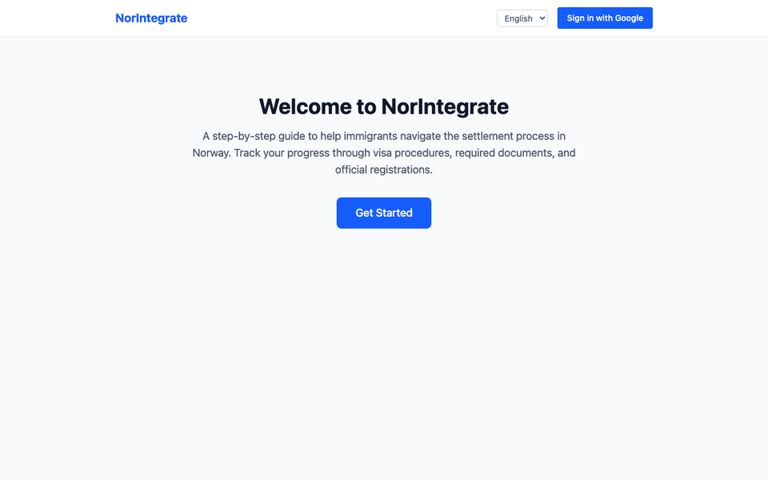
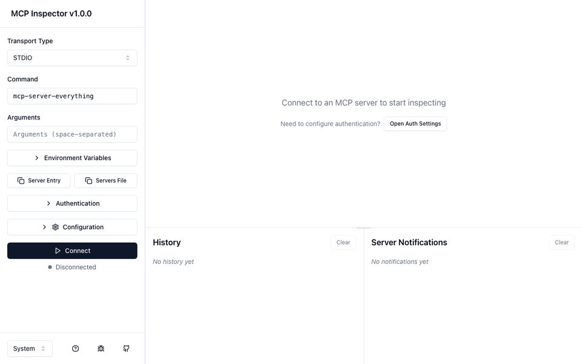
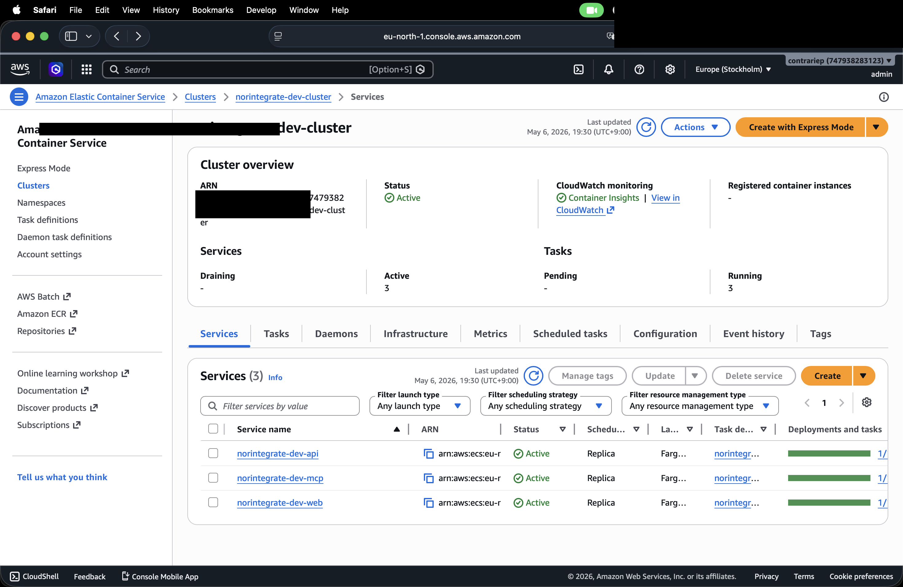
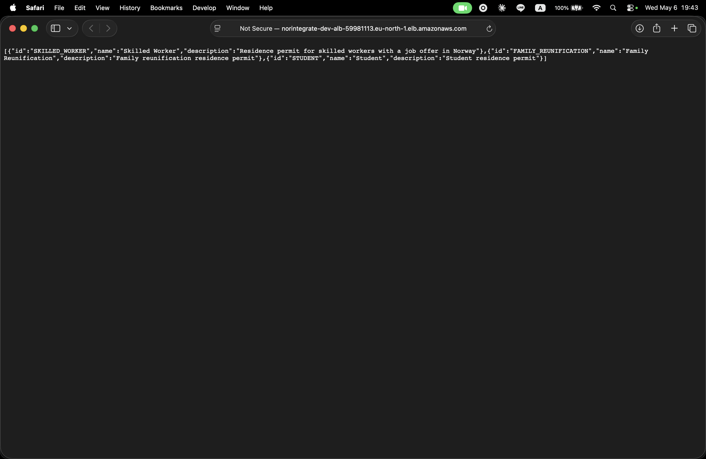
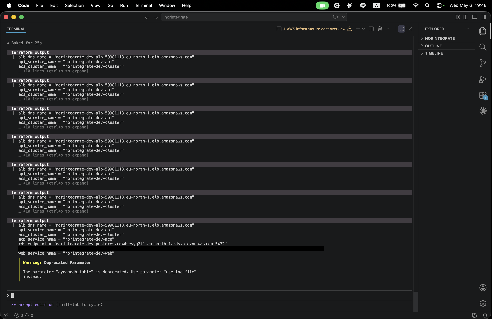

# NorIntegrate

[](LICENSE)


A platform that helps immigrants navigate the settlement process in Norway. Provides a REST API for human users, an MCP server for AI agents, and a Next.js frontend with i18n support (English/Norwegian). All backend modules share domain logic through a common library.

This project demonstrates a migration from Java 8 + Spring 3 to **Java 25 + Spring Boot 4**. Every architectural decision is documented in [`docs/adr/`](docs/adr/).

---

## Demo

**Web UI — browsing the settlement checklist, expanding steps, and switching between English and Norwegian**


**MCP tools — MCP Inspector connecting over SSE and calling `getIntegrationGuide`, the same tool an AI agent would call**


---

## Architecture

```
norintegrate/
├── norintegrate-common/   ← Shared domain: entities, services, repositories (library)
├── norintegrate-api/      ← REST API (port 8080) — OAuth 2.0 + Swagger UI
├── norintegrate-mcp/      ← MCP server for AI agents (port 8081) — Kotlin
├── norintegrate-web/      ← Next.js 15 frontend (port 3000) — Auth.js + next-intl
└── docs/                  ← ADRs, OpenAPI spec, schema, seed data
```

The API and MCP modules depend on `norintegrate-common` and never on each other. PostgreSQL 18 is the sole persistence layer. The frontend communicates with the API over HTTP.

---

## MCP Server

[Model Context Protocol (MCP)](https://modelcontextprotocol.io/) lets AI agents call structured tools directly. NorIntegrate exposes three read-only tools over SSE — no authentication required ([rationale](docs/adr/ADR-017-mcp-server-authentication-posture.md)):

| Tool | Description |
|------|-------------|
| `getIntegrationGuide` | Full settlement checklist for a visa type, topologically sorted |
| `getProcedureDetail` | Procedure details including documents, authority, estimated days |
| `searchMunicipality` | Municipality search via SSB Klass API (Statistics Norway) |

```json
{ "mcpServers": { "norintegrate": { "url": "http://localhost:8081/sse" } } }
```

---

## Quick Start

**Prerequisites:** Java 25, Node.js 22, Docker

```bash
git clone <repo-url> && cd norintegrate

# Configure environment (each module has its own .env.example)
cp norintegrate-api/.env.example norintegrate-api/.env
cp norintegrate-web/.env.example norintegrate-web/.env

# Start Postgres (schema + seed applied automatically)
docker compose up postgres -d

# Start the API
export $(cat norintegrate-api/.env | xargs)
./gradlew :norintegrate-api:bootRun

# Start the frontend (in another terminal)
cd norintegrate-web && npm install && npm run dev
```

Or run the full stack with `docker compose up`. Swagger UI is at `http://localhost:8080/swagger-ui.html`.

---

## Testing

```bash
./gradlew test                    # All modules (needs Docker for Testcontainers)
cd norintegrate-web && npm test   # Frontend unit tests (Vitest)
```

Code style: `./gradlew spotlessCheck` / `./gradlew spotlessApply` (Google Java Format for Java, ktlint for Kotlin).

Docs drift check: `bash scripts/check-docs.sh` (verifies ADR indexes, relative links, and version claims). Enable it as a local pre-commit hook with `git config core.hooksPath .githooks` — this is opt-in and bypassable with `--no-verify`; CI (`.github/workflows/docs.yml`) is the actual gate, the hook only makes feedback faster.

---

## Monitoring

```bash
docker compose --profile monitoring up   # Prometheus :9090, Grafana :3001
```

---

## Infrastructure

Provisioned on AWS (ECS Fargate + RDS) using Terraform (IaC) and validated end-to-end — see the deployment screenshots below. The stack has been torn down to avoid ongoing cost (~$53/month); it can be recreated on demand with `terraform apply` plus the setup steps in [`infra/README.md`](infra/README.md) (see [ADR-016](docs/adr/ADR-016-aws-ecs-fargate-deployment.md) for the suspension rationale).

```
Internet → ALB (HTTP:80) → ECS Fargate Cluster
                              ├─ API service  (8080) ──┐
                              ├─ MCP service  (8081) ──┤── RDS PostgreSQL 18
                              └─ Web service  (3000)   │   (db.t4g.micro)
                                                       │
                           Secrets Manager ─────────────┘
```

| Component | Spec |
|-----------|------|
| ECS Fargate | 3 services, 0.25 vCPU / 512 MB each |
| RDS PostgreSQL | 18, db.t4g.micro, single-AZ |
| ALB | Path-based routing (`/api/*`, `/mcp/*`, default → web) |
| Networking | VPC with public subnets, security groups (ALB → ECS → RDS) |
| Secrets | GHCR credentials, JWT, Google OAuth, NextAuth via Secrets Manager |

Terraform files are in [`infra/`](infra/). See [ADR-016](docs/adr/ADR-016-aws-ecs-fargate-deployment.md) for the deployment rationale.

<details>
<summary>Deployment screenshots</summary>

**ECS Cluster — 3 services running**


**API response — visa types with settlement procedures**


**Terraform output — all resources provisioned**


All screenshots: [`docs/screenshots/`](docs/screenshots/)

</details>

---

## Architecture Decision Records

| ADR | Decision |
|-----|---------|
| [ADR-001](docs/adr/ADR-001-java-8-to-java-25-lts-migration.md) | Java 8 → Java 25 LTS |
| [ADR-002](docs/adr/ADR-002-spring-boot-3-to-spring-boot-4.md) | Spring Boot 3 → Spring Boot 4 |
| [ADR-003](docs/adr/ADR-003-rest-api-and-mcp-server-separation.md) | REST API and MCP server as separate modules |
| [ADR-004](docs/adr/ADR-004-oracle-to-postgresql-migration.md) | Oracle → PostgreSQL 18 |
| [ADR-005](docs/adr/ADR-005-decision-not-to-use-spring-batch.md) | No Spring Batch |
| [ADR-006](docs/adr/ADR-006-jenkins-to-github-actions-cicd-migration.md) | Jenkins → GitHub Actions |
| [ADR-007](docs/adr/ADR-007-terraform-infrastructure-strategy.md) | Terraform for infrastructure (plan-only) |
| [ADR-008](docs/adr/ADR-008-gradle-kotlin-dsl-adoption.md) | Gradle Kotlin DSL |
| [ADR-009](docs/adr/ADR-009-monorepo-with-path-filtered-cicd.md) | Monorepo with path-filtered CI |
| [ADR-010](docs/adr/ADR-010-repository-pattern-for-data-source-abstraction.md) | Repository pattern for SSB Klass API |
| [ADR-011](docs/adr/ADR-011-integration-testing-strategy.md) | Integration testing with Testcontainers |
| [ADR-012](docs/adr/ADR-012-frontend-technology-choice.md) | Next.js with Auth.js for frontend |
| [ADR-013](docs/adr/ADR-013-observability-with-actuator-prometheus-grafana.md) | Observability with Actuator + Prometheus + Grafana |
| [ADR-014](docs/adr/ADR-014-decision-not-to-integrate-idporten.md) | No ID-porten/BankID (requires Digdir registration) |
| [ADR-015](docs/adr/ADR-015-three-layer-frontend-testing-strategy.md) | Three-layer frontend testing (Vitest + Playwright) |
| [ADR-016](docs/adr/ADR-016-aws-ecs-fargate-deployment.md) | AWS ECS Fargate deployment |
| [ADR-017](docs/adr/ADR-017-mcp-server-authentication-posture.md) | MCP server authentication posture |
| [ADR-018](docs/adr/ADR-018-structured-json-logging.md) | Structured JSON logging |
| [ADR-019](docs/adr/ADR-019-kotlin-introduction-for-mcp.md) | Kotlin for norintegrate-mcp |

---

## License

[MIT](LICENSE)
