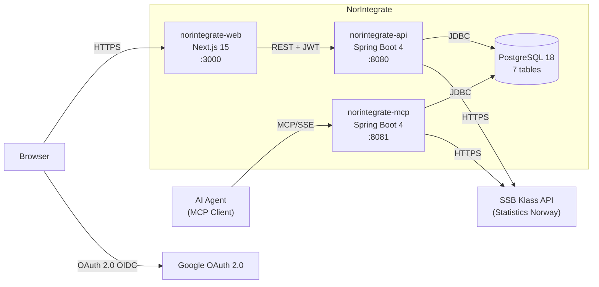
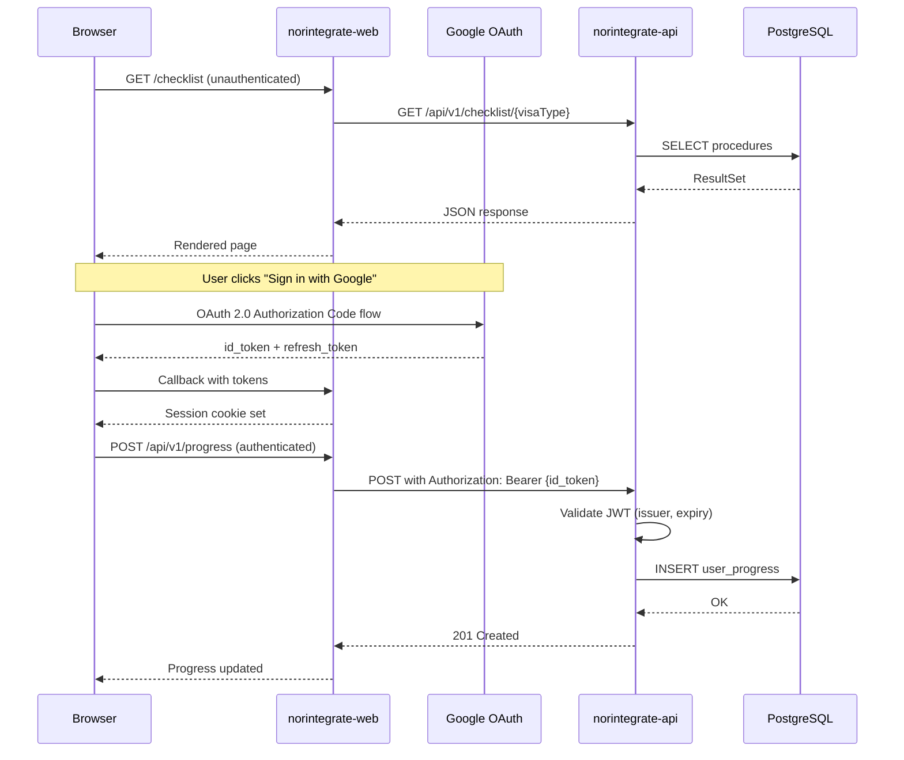
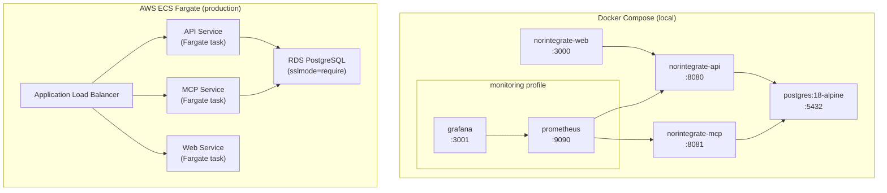

# System Architecture

This document provides a visual overview of NorIntegrate's architecture. For the rationale behind each decision, see the linked ADRs.

## Container Diagram

How the system's containers interact at runtime.

See [ADR-003](adr/ADR-003-rest-api-and-mcp-server-separation.md) for the REST/MCP separation rationale and [ADR-017](adr/ADR-017-mcp-server-authentication-posture.md) for MCP security posture.

## Authenticated Request Sequence

How a browser request flows through authentication.

## Operational Topology

Container layout for local development and production.

See [ADR-013](adr/ADR-013-observability-with-actuator-prometheus-grafana.md) for the monitoring stack and [ADR-018](adr/ADR-018-structured-json-logging.md) for production logging.
